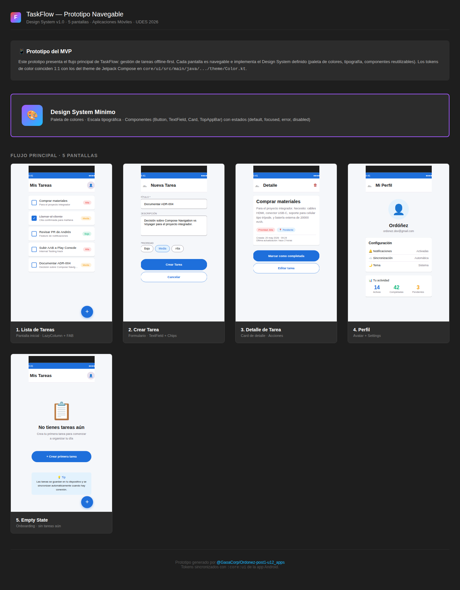
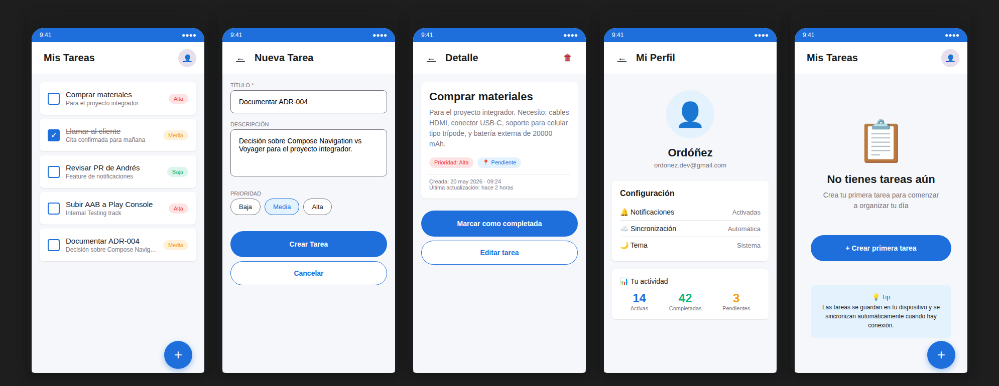
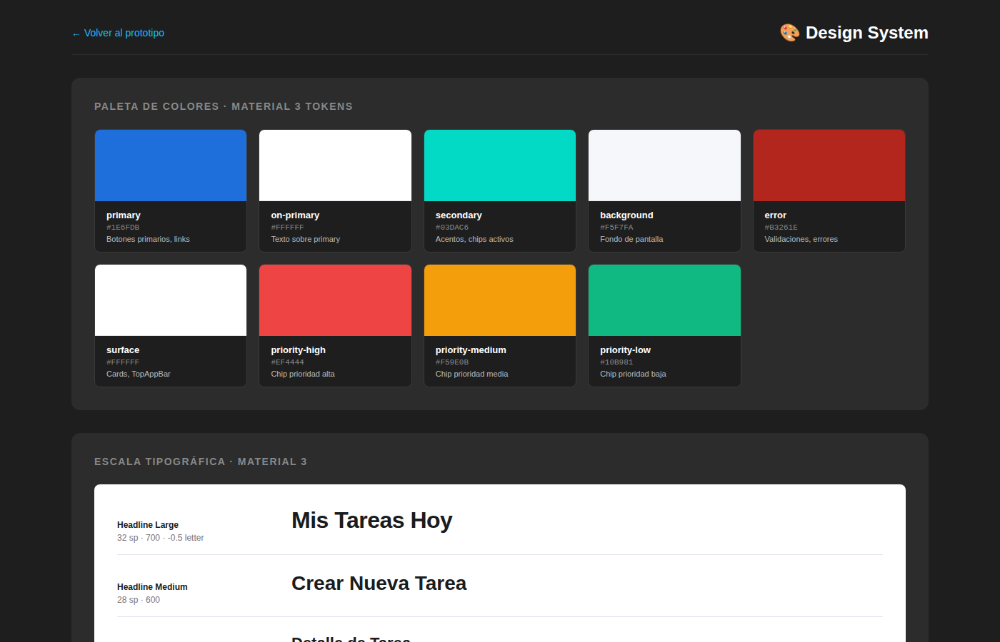
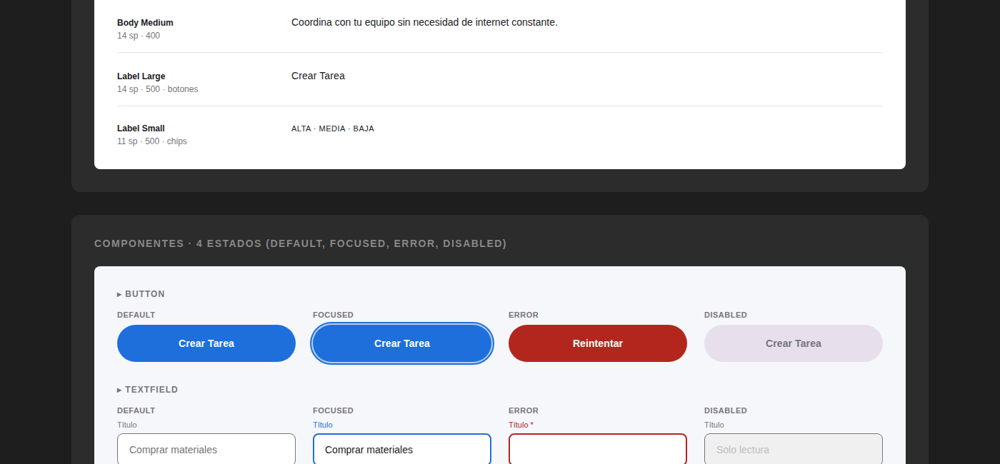

# 📱 TaskFlow — Gestión de Tareas Colaborativas

> **Aplicaciones Móviles · Unidad 12 · Post-Contenido 1**
> Universidad de Santander (UDES) · Ingeniería de Sistemas · 2026

---

## 📌 Problem Statement

Los equipos pequeños (2–6 personas) necesitan coordinar tareas diarias sin depender de herramientas de escritorio complejas. Las soluciones actuales (Trello, Asana) son poderosas pero tienen una curva de aprendizaje alta y requieren conexión constante. **TaskFlow** resuelve esto con una app Android nativa, offline-first, que sincroniza en segundo plano cuando hay conectividad, permitiendo crear, asignar y rastrear tareas desde el celular con una UX minimalista.

---

## 🏗️ Arquitectura

El proyecto adopta una arquitectura **multi-módulo** con separación clara de responsabilidades:

```
:app              → punto de entrada, navegación principal
:feature:tasks    → listado y creación de tareas
:feature:profile  → perfil de usuario y ajustes
:core:domain      → entidades, casos de uso, interfaces de repositorio
:core:data        → implementación de repositorios, Room, Retrofit
:core:ui          → Design System, componentes Compose reutilizables
```

**Stack tecnológico:**
- Kotlin + Jetpack Compose (UI)
- Hilt (inyección de dependencias)
- Room (persistencia local)
- Retrofit + OkHttp (red)
- Coroutines + Flow (asincronía)
- ViewModel + Clean Architecture (MVVM)

Ver decisiones en [`docs/adr/`](docs/adr/).

---

## 👥 Integrantes del Equipo

| Nombre | Rol |
|--------|-----|
| Ordóñez | Líder técnico / Android Dev |

---

## 🎨 Prototipo Navegable & Design System

🔗 **[Ver prototipo navegable →](https://gaoacorp.github.io/Ordonez-post1-u12_apps/)**

Prototipo interactivo con **5 pantallas del flujo principal** + **Design System completo**. Los tokens de color y tipografía coinciden 1:1 con el theme de Jetpack Compose definido en `core/ui/src/main/java/com/gaaocorp/taskflow/ui/theme/`.

### Vista general del prototipo



### Las 5 pantallas del flujo principal



| # | Pantalla | Descripción | Componentes usados |
|---|----------|-------------|---------------------|
| 1 | **Lista de Tareas** | Pantalla principal con tareas del usuario | `TopAppBar`, `LazyColumn`, `Card`, `Chip`, `FAB` |
| 2 | **Crear Tarea** | Formulario con prioridad | `TextField`, `FilterChip`, `Button` |
| 3 | **Detalle de Tarea** | Vista completa con acciones | `Card`, `Button`, `IconButton` |
| 4 | **Perfil** | Datos del usuario y configuración | `Surface`, `Card`, `Avatar` |
| 5 | **Empty State** | Onboarding sin tareas | `Button`, callout informativo |

### Design System Mínimo

El prototipo incluye una página dedicada al Design System con todos los tokens y componentes:

#### 🎨 Paleta de colores + Tipografía


#### 🧩 Componentes con sus 4 estados (default, focused, error, disabled)


**Tokens de color** sincronizados con `core/ui/.../theme/Color.kt`:
- `primary` `#1E6FDB` · `on-primary` `#FFFFFF`
- `secondary` `#03DAC6` · `background` `#F5F7FA`
- `surface` `#FFFFFF` · `error` `#B3261E`
- `priority-high` `#EF4444` · `priority-medium` `#F59E0B` · `priority-low` `#10B981`

**Escala tipográfica Material 3:** Headline (Large/Medium/Small), Title (Large/Medium/Small), Body (Large/Medium/Small), Label (Large/Medium/Small).

**Componentes reutilizables:** `Button`, `TextField`, `Card`, `TopAppBar` — cada uno implementado en `core/ui/src/main/java/com/gaaocorp/taskflow/ui/components/Components.kt` con sus 4 estados.

---

## 📐 Diagrama de Módulos


---

## 🚀 Cómo ejecutar el proyecto

### Prerrequisitos
- Android Studio Hedgehog (2023.1.1) o superior
- JDK 17
- Gradle 8.x

### Pasos
```bash
git clone https://github.com/GaoaCorp/Ordonez-post1-u12_apps.git
cd Ordonez-post1-u12_apps
./gradlew assembleDebug
```

---

## 📋 ADRs (Architecture Decision Records)

| ADR | Título | Estado |
|-----|--------|--------|
| [ADR-001](docs/adr/ADR-001-stack-tecnologico.md) | Stack Tecnológico | ✅ Aceptado |
| [ADR-002](docs/adr/ADR-002-arquitectura-modulos.md) | Arquitectura Multi-Módulo | ✅ Aceptado |
| [ADR-003](docs/adr/ADR-003-persistencia-sincronizacion.md) | Persistencia y Sincronización | ✅ Aceptado |

---

## 📁 Estructura del Repositorio

```
Ordonez-post1-u12_apps/
├── .github/
│   ├── workflows/
│   │   ├── ci.yml                  ← pipeline CI (Post 2)
│   │   └── deploy-pages.yml        ← deploy del prototipo a GitHub Pages
│   └── PULL_REQUEST_TEMPLATE.md
├── docs/
│   ├── adr/
│   │   ├── ADR-001-stack-tecnologico.md
│   │   ├── ADR-002-arquitectura-modulos.md
│   │   └── ADR-003-persistencia-sincronizacion.md
│   ├── screenshots/                ← capturas del prototipo y Design System
│   └── architecture-diagram.png
├── prototype/                      ← prototipo HTML navegable (deploya a GitHub Pages)
│   ├── index.html
│   ├── design-system.html
│   ├── screen-1-list.html ... screen-5-empty.html
│   └── styles.css
├── app/                            ← módulo :app
├── feature/                        ← módulos :feature:tasks, :feature:profile
├── core/                           ← módulos :core:domain, :core:data, :core:ui
├── gradle/
│   └── libs.versions.toml          ← version catalog
└── README.md
```
