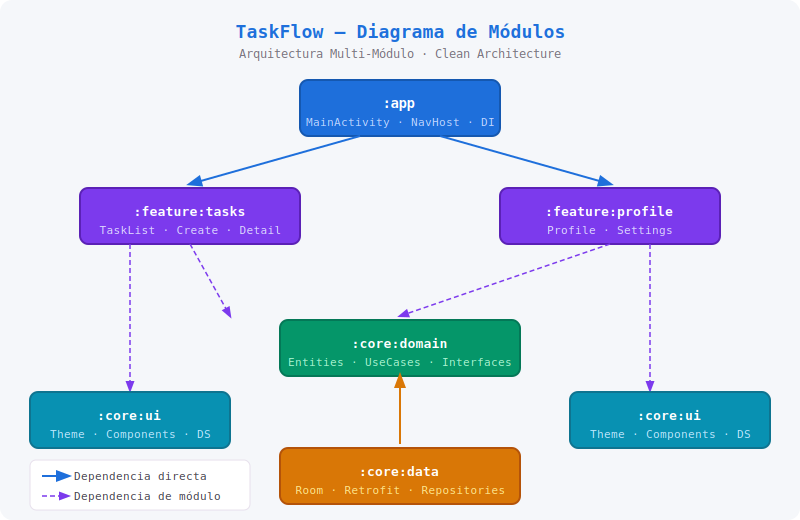

# 📱 TaskFlow — Gestión de Tareas Colaborativas

> **Aplicaciones Móviles · Unidad 12 · Post-Contenido 1**
> Universidad de Santander (UDES) · Ingeniería de Sistemas · 2026

---

## 📌 Problem Statement

Los equipos pequeños (2–6 personas) necesitan coordinar tareas diarias sin depender de herramientas de escritorio complejas. Las soluciones actuales (Trello, Asana) son poderosas pero tienen una curva de aprendizaje alta y requieren conexión constante. **TaskFlow** resuelve esto con una app Android nativa, offline-first, que sincroniza en segundo plano cuando hay conectividad, permitiendo crear, asignar y rastrear tareas desde el celular con una UX minimalista.

---

## 🏗️ Arquitectura

El proyecto adopta una arquitectura **multi-módulo** con separación clara de responsabilidades:

```
:app              → punto de entrada, navegación principal
:feature:tasks    → listado y creación de tareas
:feature:profile  → perfil de usuario y ajustes
:core:domain      → entidades, casos de uso, interfaces de repositorio
:core:data        → implementación de repositorios, Room, Retrofit
:core:ui          → Design System, componentes Compose reutilizables
```

**Stack tecnológico:**
- Kotlin + Jetpack Compose (UI)
- Hilt (inyección de dependencias)
- Room (persistencia local)
- Retrofit + OkHttp (red)
- Coroutines + Flow (asincronía)
- ViewModel + Clean Architecture (MVVM)

Ver decisiones en [`docs/adr/`](docs/adr/).

---

## 👥 Integrantes del Equipo

| Nombre | Rol |
|--------|-----|
| Ordóñez | Líder técnico / Android Dev |

---

## 🎨 Prototipo Figma

🔗 [Ver prototipo navegable en Figma](https://www.figma.com/proto/placeholder-link)

> El prototipo incluye 5 pantallas del flujo principal con Design System (paleta de colores, tipografía, componentes reutilizables).

---

## 📐 Diagrama de Módulos



---

## 🚀 Cómo ejecutar el proyecto

### Prerrequisitos
- Android Studio Hedgehog (2023.1.1) o superior
- JDK 17
- Gradle 8.x

### Pasos
```bash
git clone https://github.com/GaoaCorp/Ordonez-post1-u12_apps.git
cd Ordonez-post1-u12_apps
./gradlew assembleDebug
```

---

## 📋 ADRs (Architecture Decision Records)

| ADR | Título | Estado |
|-----|--------|--------|
| [ADR-001](docs/adr/ADR-001-stack-tecnologico.md) | Stack Tecnológico | ✅ Aceptado |
| [ADR-002](docs/adr/ADR-002-arquitectura-modulos.md) | Arquitectura Multi-Módulo | ✅ Aceptado |
| [ADR-003](docs/adr/ADR-003-persistencia-sincronizacion.md) | Persistencia y Sincronización | ✅ Aceptado |

---

## 📁 Estructura del Repositorio

```
Ordonez-post1-u12_apps/
├── .github/
│   ├── workflows/
│   │   └── ci.yml
│   └── PULL_REQUEST_TEMPLATE.md
├── docs/
│   ├── adr/
│   │   ├── ADR-001-stack-tecnologico.md
│   │   ├── ADR-002-arquitectura-modulos.md
│   │   └── ADR-003-persistencia-sincronizacion.md
│   └── architecture-diagram.png
├── app/
├── feature/
├── core/
├── gradle/
│   └── libs.versions.toml
└── README.md
```
